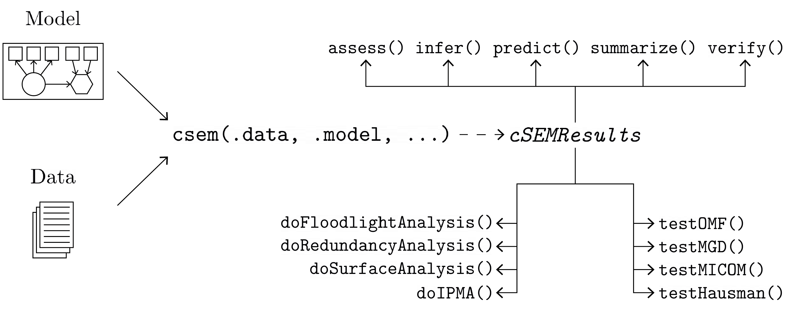

<!-- README.md is generated from README.Rmd. Please edit that file -->

# cSEM: Composite-based SEM </a>

[](https://cran.r-project.org/package=cSEM)
[](https://travis-ci.com/M-E-Rademaker/cSEM)
[](https://ci.appveyor.com/project/M-E-Rademaker/csem)
[](https://cran.r-project.org/package=cSEM)
<!-- WARNING: THIS IS WORK IN PROGRESS. BREAKING CHANGES TO THE API ARE VERY LIKELY.  -->
<!--          Use the package with caution and please report bugs to [the package developers](mailto:manuel.rademaker@uni-wuerzburg.de;f.schuberth@utwente.nl).  -->
<!--          The first stable relase will be version 0.0.1, most likely towards the end -->
<!--          of 2019. -->

## Purpose

Estimate, analyse, test, and study linear, nonlinear, hierachical and
multi-group structural equation models using composite-based approaches
and procedures, including estimation techniques such as partial least
squares path modeling (PLS-PM) and its derivatives (PLSc, OrdPLSc,
robustPLSc), generalized structured component analysis (GSCA),
generalized structured component analysis with uniqueness terms (GSCAm),
generalized canonical correlation analysis (GCCA), principal component
analysis (PCA), factor score regression (FSR) using sum score,
regression or bartlett scores (including bias correction using Croon’s
approach), as well as several tests and typical postestimation
procedures (e.g., verify admissibility of the estimates, assess the
model fit, test the model fit, compute confidence intervals, compare
groups, etc.).

## Installation

The package is available on [CRAN](https://cran.r-project.org/):

``` r
install.packages("cSEM")
```

To install the development version use:

``` r
# install.packages("devtools")
devtools::install_github("M-E-Rademaker/cSEM")
```

## Getting started

The best place to get started is the
[cSEM-website](https://m-e-rademaker.github.io/cSEM/).

<!-- ## Philosophy -->

<!-- - First and foremost: `cSEM` has a user-centered design!. "User-centered" mainly  -->

<!--   boils down to: `cSEM` is easy, i.e. intuitive to use by non-R experts!  -->

<!-- - Modern in a sense that the package integrates modern developments within  -->

<!--   the R community. This mainly includes ideas/recommendations/design choices that -->

<!--   fead into the packages of the [tidyverse](https://github.com/tidyverse/tidyverse). -->

<!-- - State of the art in a sense that we seek to quickly implement recent methodological -->

<!--   developments in composite-based SEM.  -->

## Basic usage

The basic usage is illustrated below.



Usully, using `cSEM` is the same 3 step procedure:

> 1.  Pick a dataset and specify a model using [lavaan
>     syntax](http://lavaan.ugent.be/tutorial/syntax1.html)
> 2.  Use `csem()`
> 3.  Apply one of the postestimation functions listed below on the
>     resulting object.

## Postestimation functions

There are five major postestimation verbs, four test family functions
and four do-family of function:

  - `assess()` : assess the model using common quality criteria
  - `infer()` : calculate common inferencial quantities (e.g., standard
    errors, confidence intervals)
  - `predict()` : predict endogenous indicator values
  - `summarize()` : summarize the results
  - `verify()` : verify admissibility of the estimates

Tests are performed by using the test family of functions. Currently,
the following tests are implemented:

  - `testOMF()` : performs a test for overall model fit
  - `testMICOM()` : performs a test for composite measurement invariance
  - `testMGD()` : performs several tests to assess multi-group
    differences
  - `testHausman()` : performs the regression-based Hausman test to test
    for endogeneity

Other miscellaneous postestimation functions belong do the do-family of
functions. Currently, four do functions are implemented:

  - `doIPMA()`: performs an importance-performance matrix analysis
  - `doNonLinearEffectsnalysis()`: performs a nonlinear effects analysis
    such as floodlight and surface analysis
  - `doRedundancyAnalysis()`: performs a redundancy analysis

All functions require a `cSEMResults` object.

## Example

Models are defined using [lavaan
syntax](http://lavaan.ugent.be/tutorial/syntax1.html) with some slight
modifications (see the [Specifying a
model](https://m-e-rademaker.github.io/cSEM/articles/cSEM.html#using-csem)
section on the [cSEM-website](https://m-e-rademaker.github.io/cSEM/)).
For illustration we use the build-in and well-known `satisfaction`
dataset.

``` r
require(cSEM)
    
## Note: The operator "<~" tells cSEM that the construct to its left is modelled
##       as a composite.
##       The operator "=~" tells cSEM that the construct to its left is modelled
##       as a common factor.
##       The operator "~" tells cSEM which are the dependent (left-hand side) and
##       independent variables (right-hand side).
    
model <- "
# Structural model
EXPE ~ IMAG
QUAL ~ EXPE
VAL  ~ EXPE + QUAL
SAT  ~ IMAG + EXPE + QUAL + VAL 
LOY  ~ IMAG + SAT

# Composite model
IMAG <~ imag1 + imag2 + imag3
EXPE <~ expe1 + expe2 + expe3 
QUAL <~ qual1 + qual2 + qual3 + qual4 + qual5
VAL  <~ val1  + val2  + val3

# Reflective measurement model
SAT  =~ sat1  + sat2  + sat3  + sat4
LOY  =~ loy1  + loy2  + loy3  + loy4
"
```

The estimation is conducted using the `csem()` function.

``` r
# Estimate using defaults
res <- csem(.data = satisfaction, .model = model)
res
```

    ## ________________________________________________________________________________
    ## ----------------------------------- Overview -----------------------------------
    ## 
    ## Estimation was successful.
    ## 
    ## The result is a list of class cSEMResults with list elements:
    ## 
    ##  - Estimates
    ##  - Information
    ## 
    ## To get an overview or help type:
    ## 
    ##  - ?cSEMResults
    ##  - str(<object-name>)
    ##  - listviewer::jsondedit(<object-name>, mode = 'view')
    ## 
    ## If you wish to access the list elements directly type e.g. 
    ## 
    ##  - <object-name>$Estimates
    ## 
    ## Available postestimation commands:
    ## 
    ##  - assess(<object-name>)
    ##  - infer(<object-name)
    ##  - predict(<object-name>)
    ##  - summarize(<object-name>)
    ##  - verify(<object-name>)
    ## ________________________________________________________________________________

This is equal to:

``` r
csem(
   .data                        = satisfaction,
   .model                       = model,
   .approach_cor_robust         = "none",
   .approach_nl                 = "sequential",
   .approach_paths              = "OLS",
   .approach_weights            = "PLS-PM",
   .conv_criterion              = "diff_absolute",
   .disattenuate                = TRUE,
   .dominant_indicators         = NULL,
   .estimate_structural         = TRUE,
   .id                          = NULL,
   .iter_max                    = 100,
   .normality                   = FALSE,
   .PLS_approach_cf             = "dist_squared_euclid",
   .PLS_ignore_structural_model = FALSE,
   .PLS_modes                   = NULL,
   .PLS_weight_scheme_inner     = "path",
   .reliabilities               = NULL,
   .starting_values             = NULL,
   .tolerance                   = 1e-05,
   .resample_method             = "none", 
   .resample_method2            = "none",
   .R                           = 499,
   .R2                          = 199,
   .handle_inadmissibles        = "drop",
   .user_funs                   = NULL,
   .eval_plan                   = "sequential",
   .seed                        = NULL,
   .sign_change_option          = "none"
    )
```

The result is always a named list of class `cSEMResults`.

To access list elements use `$`:

``` r
res$Estimates$Loading_estimates 
res$Information$Model
```

A useful tool to examine a list is the [listviewer
package](https://github.com/timelyportfolio/listviewer). If you are new
to `cSEM` this might be a good way to familiarize yourself with the
structure of a `cSEMResults` object.

``` r
listviewer::jsonedit(res, mode = "view") # requires the listviewer package.
```

Apply postestimation functions:

``` r
## Get a summary
summarize(res) 
```

    ## ________________________________________________________________________________
    ## ----------------------------------- Overview -----------------------------------
    ## 
    ##  General information:
    ##  ------------------------
    ##  Estimation status                = Ok
    ##  Number of observations           = 250
    ##  Weight estimator                 = PLS-PM
    ##  Inner weighting scheme           = "path"
    ##  Type of indicator correlation    = Pearson
    ##  Path model estimator             = OLS
    ##  Second-order approach            = NA
    ##  Type of path model               = Linear
    ##  Disattenuated                    = Yes (PLSc)
    ## 
    ##  Construct details:
    ##  ------------------
    ##  Name  Modeled as     Order         Mode      
    ## 
    ##  IMAG  Composite      First order   "modeB"   
    ##  EXPE  Composite      First order   "modeB"   
    ##  QUAL  Composite      First order   "modeB"   
    ##  VAL   Composite      First order   "modeB"   
    ##  SAT   Common factor  First order   "modeA"   
    ##  LOY   Common factor  First order   "modeA"   
    ## 
    ## ----------------------------------- Estimates ----------------------------------
    ## 
    ## Estimated path coefficients:
    ## ============================
    ##   Path           Estimate  Std. error   t-stat.   p-value
    ##   EXPE ~ IMAG      0.4714          NA        NA        NA
    ##   QUAL ~ EXPE      0.8344          NA        NA        NA
    ##   VAL ~ EXPE       0.0457          NA        NA        NA
    ##   VAL ~ QUAL       0.7013          NA        NA        NA
    ##   SAT ~ IMAG       0.2450          NA        NA        NA
    ##   SAT ~ EXPE      -0.0172          NA        NA        NA
    ##   SAT ~ QUAL       0.2215          NA        NA        NA
    ##   SAT ~ VAL        0.5270          NA        NA        NA
    ##   LOY ~ IMAG       0.1819          NA        NA        NA
    ##   LOY ~ SAT        0.6283          NA        NA        NA
    ## 
    ## Estimated loadings:
    ## ===================
    ##   Loading          Estimate  Std. error   t-stat.   p-value
    ##   IMAG =~ imag1      0.6306          NA        NA        NA
    ##   IMAG =~ imag2      0.9246          NA        NA        NA
    ##   IMAG =~ imag3      0.9577          NA        NA        NA
    ##   EXPE =~ expe1      0.7525          NA        NA        NA
    ##   EXPE =~ expe2      0.9348          NA        NA        NA
    ##   EXPE =~ expe3      0.7295          NA        NA        NA
    ##   QUAL =~ qual1      0.7861          NA        NA        NA
    ##   QUAL =~ qual2      0.9244          NA        NA        NA
    ##   QUAL =~ qual3      0.7560          NA        NA        NA
    ##   QUAL =~ qual4      0.7632          NA        NA        NA
    ##   QUAL =~ qual5      0.7834          NA        NA        NA
    ##   VAL =~ val1        0.9518          NA        NA        NA
    ##   VAL =~ val2        0.8056          NA        NA        NA
    ##   VAL =~ val3        0.6763          NA        NA        NA
    ##   SAT =~ sat1        0.9243          NA        NA        NA
    ##   SAT =~ sat2        0.8813          NA        NA        NA
    ##   SAT =~ sat3        0.7127          NA        NA        NA
    ##   SAT =~ sat4        0.7756          NA        NA        NA
    ##   LOY =~ loy1        0.9097          NA        NA        NA
    ##   LOY =~ loy2        0.5775          NA        NA        NA
    ##   LOY =~ loy3        0.9043          NA        NA        NA
    ##   LOY =~ loy4        0.4917          NA        NA        NA
    ## 
    ## Estimated weights:
    ## ==================
    ##   Weight           Estimate  Std. error   t-stat.   p-value
    ##   IMAG <~ imag1      0.0156          NA        NA        NA
    ##   IMAG <~ imag2      0.4473          NA        NA        NA
    ##   IMAG <~ imag3      0.6020          NA        NA        NA
    ##   EXPE <~ expe1      0.2946          NA        NA        NA
    ##   EXPE <~ expe2      0.6473          NA        NA        NA
    ##   EXPE <~ expe3      0.2374          NA        NA        NA
    ##   QUAL <~ qual1      0.2370          NA        NA        NA
    ##   QUAL <~ qual2      0.4712          NA        NA        NA
    ##   QUAL <~ qual3      0.1831          NA        NA        NA
    ##   QUAL <~ qual4      0.1037          NA        NA        NA
    ##   QUAL <~ qual5      0.2049          NA        NA        NA
    ##   VAL <~ val1        0.7163          NA        NA        NA
    ##   VAL <~ val2        0.2202          NA        NA        NA
    ##   VAL <~ val3        0.2082          NA        NA        NA
    ##   SAT <~ sat1        0.3209          NA        NA        NA
    ##   SAT <~ sat2        0.3059          NA        NA        NA
    ##   SAT <~ sat3        0.2474          NA        NA        NA
    ##   SAT <~ sat4        0.2692          NA        NA        NA
    ##   LOY <~ loy1        0.3834          NA        NA        NA
    ##   LOY <~ loy2        0.2434          NA        NA        NA
    ##   LOY <~ loy3        0.3812          NA        NA        NA
    ##   LOY <~ loy4        0.2073          NA        NA        NA
    ## 
    ## Estimated indicator correlations:
    ## =================================
    ##   Correlation       Estimate  Std. error   t-stat.   p-value
    ##   imag1 ~~ imag2      0.6437          NA        NA        NA
    ##   imag1 ~~ imag3      0.5433          NA        NA        NA
    ##   imag2 ~~ imag3      0.7761          NA        NA        NA
    ##   expe1 ~~ expe2      0.5353          NA        NA        NA
    ##   expe1 ~~ expe3      0.4694          NA        NA        NA
    ##   expe2 ~~ expe3      0.5467          NA        NA        NA
    ##   qual1 ~~ qual2      0.6053          NA        NA        NA
    ##   qual1 ~~ qual3      0.5406          NA        NA        NA
    ##   qual1 ~~ qual4      0.5662          NA        NA        NA
    ##   qual1 ~~ qual5      0.5180          NA        NA        NA
    ##   qual2 ~~ qual3      0.6187          NA        NA        NA
    ##   qual2 ~~ qual4      0.6517          NA        NA        NA
    ##   qual2 ~~ qual5      0.6291          NA        NA        NA
    ##   qual3 ~~ qual4      0.4752          NA        NA        NA
    ##   qual3 ~~ qual5      0.5074          NA        NA        NA
    ##   qual4 ~~ qual5      0.6402          NA        NA        NA
    ##   val1 ~~ val2        0.6344          NA        NA        NA
    ##   val1 ~~ val3        0.4602          NA        NA        NA
    ##   val2 ~~ val3        0.6288          NA        NA        NA
    ## 
    ## ------------------------------------ Effects -----------------------------------
    ## 
    ## Estimated total effects:
    ## ========================
    ##   Total effect    Estimate  Std. error   t-stat.   p-value
    ##   EXPE ~ IMAG       0.4714          NA        NA        NA
    ##   QUAL ~ IMAG       0.3933          NA        NA        NA
    ##   QUAL ~ EXPE       0.8344          NA        NA        NA
    ##   VAL ~ IMAG        0.2974          NA        NA        NA
    ##   VAL ~ EXPE        0.6309          NA        NA        NA
    ##   VAL ~ QUAL        0.7013          NA        NA        NA
    ##   SAT ~ IMAG        0.4807          NA        NA        NA
    ##   SAT ~ EXPE        0.5001          NA        NA        NA
    ##   SAT ~ QUAL        0.5911          NA        NA        NA
    ##   SAT ~ VAL         0.5270          NA        NA        NA
    ##   LOY ~ IMAG        0.4840          NA        NA        NA
    ##   LOY ~ EXPE        0.3142          NA        NA        NA
    ##   LOY ~ QUAL        0.3714          NA        NA        NA
    ##   LOY ~ VAL         0.3311          NA        NA        NA
    ##   LOY ~ SAT         0.6283          NA        NA        NA
    ## 
    ## Estimated indirect effects:
    ## ===========================
    ##   Indirect effect    Estimate  Std. error   t-stat.   p-value
    ##   QUAL ~ IMAG          0.3933          NA        NA        NA
    ##   VAL ~ IMAG           0.2974          NA        NA        NA
    ##   VAL ~ EXPE           0.5852          NA        NA        NA
    ##   SAT ~ IMAG           0.2357          NA        NA        NA
    ##   SAT ~ EXPE           0.5173          NA        NA        NA
    ##   SAT ~ QUAL           0.3696          NA        NA        NA
    ##   LOY ~ IMAG           0.3020          NA        NA        NA
    ##   LOY ~ EXPE           0.3142          NA        NA        NA
    ##   LOY ~ QUAL           0.3714          NA        NA        NA
    ##   LOY ~ VAL            0.3311          NA        NA        NA
    ## ________________________________________________________________________________

``` r
## Verify admissibility of the results
verify(res) 
```

    ## ________________________________________________________________________________
    ## 
    ## Verify admissibility:
    ## 
    ##   admissible
    ## 
    ## Details:
    ## 
    ##   Code   Status    Description
    ##   1      ok        Convergence achieved                                   
    ##   2      ok        All absolute standardized loading estimates <= 1       
    ##   3      ok        Construct VCV is positive semi-definite                
    ##   4      ok        All reliability estimates <= 1                         
    ##   5      ok        Model-implied indicator VCV is positive semi-definite  
    ## ________________________________________________________________________________

``` r
## Test overall model fit
testOMF(res, .verbose = FALSE)
```

    ## ________________________________________________________________________________
    ## --------- Test for overall model fit based on Beran & Srivastava (1985) --------
    ## 
    ## Null hypothesis:
    ## 
    ##               +------------------------------------------------------------------+
    ##               |                                                                  |
    ##               |   H0: The model-implied indicator covariance matrix equals the   |
    ##               |   population indicator covariance matrix.                        |
    ##               |                                                                  |
    ##               +------------------------------------------------------------------+
    ## 
    ## Test statistic and critical value: 
    ## 
    ##                                      Critical value
    ##  Distance measure    Test statistic    95%   
    ##  dG                      0.6493      0.3298  
    ##  SRMR                    0.0940      0.0523  
    ##  dL                      2.2340      0.6933  
    ##  dML                     2.9219      1.6011  
    ##  
    ## 
    ## Decision: 
    ## 
    ##                          Significance level
    ##  Distance measure          95%   
    ##  dG                      reject  
    ##  SRMR                    reject  
    ##  dL                      reject  
    ##  dML                     reject  
    ##  
    ## Additonal information:
    ## 
    ##  Out of 499 bootstrap replications 483 are admissible.
    ##  See ?verify() for what constitutes an inadmissible result.
    ## 
    ##  The seed used was: -385433315
    ## ________________________________________________________________________________

``` r
## Assess the model
assess(res)
```

    ## ________________________________________________________________________________
    ## 
    ##  Construct        AVE           R2          R2_adj    
    ##  SAT            0.6851        0.7624        0.7585    
    ##  LOY            0.5552        0.5868        0.5834    
    ##  EXPE             NA          0.2222        0.2190    
    ##  QUAL             NA          0.6963        0.6951    
    ##  VAL              NA          0.5474        0.5438    
    ## 
    ## -------------- Common (internal consistency) reliability estimates -------------
    ## 
    ##  Construct Cronbachs_alpha   Joereskogs_rho   Dijkstra-Henselers_rho_A 
    ##  SAT        0.8940           0.8960                0.9051          
    ##  LOY        0.8194           0.8237                0.8761          
    ## 
    ## ----------- Alternative (internal consistency) reliability estimates -----------
    ## 
    ##  Construct       RhoC         RhoC_mm    RhoC_weighted
    ##  SAT            0.8960        0.8938        0.9051    
    ##  LOY            0.8237        0.8011        0.8761    
    ## 
    ##  Construct  RhoC_weighted_mm     RhoT      RhoT_weighted
    ##  SAT            0.9051        0.8940        0.8869    
    ##  LOY            0.8761        0.8194        0.7850    
    ## 
    ## --------------------------- Distance and fit measures --------------------------
    ## 
    ##  Geodesic distance           = 0.6493432
    ##  Squared Euclidian distance  = 2.23402
    ##  ML distance                 = 2.921932
    ## 
    ##  Chi_square     = 727.5611
    ##  Chi_square_df  = 3.954137
    ##  CFI            = 0.8598825
    ##  GFI            = 0.7280612
    ##  IFI            = 0.8615598
    ##  NFI            = 0.8229918
    ##  NNFI           = 0.8240917
    ##  RMSEA          = 0.108922
    ##  RMS_theta      = 0.05069299
    ##  SRMR           = 0.09396871
    ## 
    ##  Degrees of freedom    = 184
    ## 
    ## ----------------------- Variance inflation factors (VIFs) ----------------------
    ## 
    ##   Dependent construct: 'VAL'
    ## 
    ##  Independent construct    VIF value 
    ##  EXPE                      3.2928   
    ##  QUAL                      3.2928   
    ##  IMAG                      0.0000   
    ##  VAL                       0.0000   
    ##  SAT                       0.0000   
    ## 
    ##   Dependent construct: 'SAT'
    ## 
    ##  Independent construct    VIF value 
    ##  EXPE                      3.2985   
    ##  QUAL                      4.4151   
    ##  IMAG                      1.7280   
    ##  VAL                       2.6726   
    ##  SAT                       0.0000   
    ## 
    ##   Dependent construct: 'LOY'
    ## 
    ##  Independent construct    VIF value 
    ##  EXPE                      0.0000   
    ##  QUAL                      0.0000   
    ##  IMAG                      1.9345   
    ##  VAL                       0.0000   
    ##  SAT                       1.9345   
    ## 
    ## -------------------------- Effect sizes (Cohen's f^2) --------------------------
    ## 
    ##   Dependent construct: 'EXPE'
    ## 
    ##  Independent construct       f^2    
    ##  IMAG                      0.2856   
    ## 
    ##   Dependent construct: 'QUAL'
    ## 
    ##  Independent construct       f^2    
    ##  EXPE                      2.2928   
    ## 
    ##   Dependent construct: 'VAL'
    ## 
    ##  Independent construct       f^2    
    ##  EXPE                      0.0014   
    ##  QUAL                      0.3301   
    ## 
    ##   Dependent construct: 'SAT'
    ## 
    ##  Independent construct       f^2    
    ##  IMAG                      0.1462   
    ##  EXPE                      0.0004   
    ##  QUAL                      0.0468   
    ##  VAL                       0.4373   
    ## 
    ##   Dependent construct: 'LOY'
    ## 
    ##  Independent construct       f^2    
    ##  IMAG                      0.0414   
    ##  SAT                       0.4938   
    ## 
    ## ------------------------------ Validity assessment -----------------------------
    ## 
    ##  Heterotrait-monotrait ratio of correlations matrix (HTMT matrix)
    ## 
    ##           SAT LOY
    ## SAT 1.0000000   0
    ## LOY 0.7432489   1
    ## 
    ## 
    ##  Fornell-Larcker matrix
    ## 
    ##           SAT       LOY
    ## SAT 0.6851491 0.5696460
    ## LOY 0.5696460 0.5551718
    ## 
    ## 
    ## ------------------------------------ Effects -----------------------------------
    ## 
    ## Estimated total effects:
    ## ========================
    ##   Total effect    Estimate  Std. error   t-stat.   p-value
    ##   EXPE ~ IMAG       0.4714          NA        NA        NA
    ##   QUAL ~ IMAG       0.3933          NA        NA        NA
    ##   QUAL ~ EXPE       0.8344          NA        NA        NA
    ##   VAL ~ IMAG        0.2974          NA        NA        NA
    ##   VAL ~ EXPE        0.6309          NA        NA        NA
    ##   VAL ~ QUAL        0.7013          NA        NA        NA
    ##   SAT ~ IMAG        0.4807          NA        NA        NA
    ##   SAT ~ EXPE        0.5001          NA        NA        NA
    ##   SAT ~ QUAL        0.5911          NA        NA        NA
    ##   SAT ~ VAL         0.5270          NA        NA        NA
    ##   LOY ~ IMAG        0.4840          NA        NA        NA
    ##   LOY ~ EXPE        0.3142          NA        NA        NA
    ##   LOY ~ QUAL        0.3714          NA        NA        NA
    ##   LOY ~ VAL         0.3311          NA        NA        NA
    ##   LOY ~ SAT         0.6283          NA        NA        NA
    ## 
    ## Estimated indirect effects:
    ## ===========================
    ##   Indirect effect    Estimate  Std. error   t-stat.   p-value
    ##   QUAL ~ IMAG          0.3933          NA        NA        NA
    ##   VAL ~ IMAG           0.2974          NA        NA        NA
    ##   VAL ~ EXPE           0.5852          NA        NA        NA
    ##   SAT ~ IMAG           0.2357          NA        NA        NA
    ##   SAT ~ EXPE           0.5173          NA        NA        NA
    ##   SAT ~ QUAL           0.3696          NA        NA        NA
    ##   LOY ~ IMAG           0.3020          NA        NA        NA
    ##   LOY ~ EXPE           0.3142          NA        NA        NA
    ##   LOY ~ QUAL           0.3714          NA        NA        NA
    ##   LOY ~ VAL            0.3311          NA        NA        NA
    ## ________________________________________________________________________________

``` r
## Predict indicator scores of endogenous constructs
predict(res)
```

    ## ________________________________________________________________________________
    ## ----------------------------------- Overview -----------------------------------
    ## 
    ##  Number of obs. training          = 225
    ##  Number of obs. test              = 25
    ##  Number of cv folds               = 10
    ##  Number of repetitions            = 10
    ##  Handle inadmissibles             = stop
    ##  Target                           = 'PLS-PM'
    ##  Benchmark                        = 'lm'
    ## 
    ## ------------------------------ Prediction metrics ------------------------------
    ## 
    ## 
    ##   Name      MAE target  MAE benchmark  RMSE target RMSE benchmark   Q2_predict
    ##   expe1         1.4567         1.5691       1.9084         2.0967       0.0560
    ##   expe2         1.4144         1.4795       1.9355         2.0268       0.2022
    ##   expe3         1.6335         1.7301       2.1277         2.2252       0.1247
    ##   qual1         1.4788         1.5428       1.9307         2.0585       0.1152
    ##   qual2         1.5805         1.5365       2.0414         2.0592       0.2184
    ##   qual3         1.7333         1.7283       2.2251         2.2846       0.1196
    ##   qual4         1.2340         1.1982       1.5979         1.6327       0.2318
    ##   qual5         1.5058         1.5000       1.9356         1.9512       0.1973
    ##   val1          1.4481         1.3650       1.8727         1.7659       0.2502
    ##   val2          1.2279         1.2054       1.6493         1.7135       0.1746
    ##   val3          1.4832         1.3817       1.9705         1.9353       0.1479
    ##   sat1          1.2482         1.2319       1.6468         1.6174       0.3394
    ##   sat2          1.2330         1.1972       1.6413         1.6266       0.3103
    ##   sat3          1.3406         1.2787       1.6723         1.7238       0.2129
    ##   sat4          1.3172         1.2604       1.6655         1.6335       0.2785
    ##   loy1          1.6952         1.6602       2.2364         2.2277       0.2663
    ##   loy2          1.4856         1.4761       1.9135         1.9838       0.1305
    ##   loy3          1.7019         1.6685       2.2799         2.2680       0.2703
    ##   loy4          1.6904         1.6695       2.1804         2.3004       0.0836
    ## ________________________________________________________________________________

#### Resampling and Inference

By default no inferential quantities are calculated since most
composite-based estimators have no closed-form expressions for standard
errors. Resampling is used instead. `cSEM` mostly relies on the
`bootstrap` procedure (although `jackknife` is implemented as well) to
estimate standard errors, test statistics, and critical quantiles.

`cSEM` offers two ways to compute resamples:

1.  Setting `.resample_method` in `csem()` to `"jackkinfe"` or
    `"bootstrap"` and subsequently using postestimation functions
    `summarize()` or `infer()`.
2.  The same result is achieved by passing a `cSEMResults` object to
    `resamplecSEMResults()` and subsequently using postestimation
    functions `summarize()` or `infer()`.

<!-- end list -->

``` r
# Setting `.resample_method`
b1 <- csem(.data = satisfaction, .model = model, .resample_method = "bootstrap")
# Using resamplecSEMResults()
b2 <- resamplecSEMResults(res)
```

Now `summarize()` shows inferencial quantities as well:

``` r
summarize(b1)
```

    ## ________________________________________________________________________________
    ## ----------------------------------- Overview -----------------------------------
    ## 
    ##  General information:
    ##  ------------------------
    ##  Estimation status                = Ok
    ##  Number of observations           = 250
    ##  Weight estimator                 = PLS-PM
    ##  Inner weighting scheme           = "path"
    ##  Type of indicator correlation    = Pearson
    ##  Path model estimator             = OLS
    ##  Second-order approach            = NA
    ##  Type of path model               = Linear
    ##  Disattenuated                    = Yes (PLSc)
    ## 
    ##  Resample information:
    ##  ---------------------
    ##  Resample method                  = "bootstrap"
    ##  Number of resamples              = 499
    ##  Number of admissible results     = 482
    ##  Approach to handle inadmissibles = "drop"
    ##  Sign change option               = "none"
    ##  Random seed                      = -899914225
    ## 
    ##  Construct details:
    ##  ------------------
    ##  Name  Modeled as     Order         Mode      
    ## 
    ##  IMAG  Composite      First order   "modeB"   
    ##  EXPE  Composite      First order   "modeB"   
    ##  QUAL  Composite      First order   "modeB"   
    ##  VAL   Composite      First order   "modeB"   
    ##  SAT   Common factor  First order   "modeA"   
    ##  LOY   Common factor  First order   "modeA"   
    ## 
    ## ----------------------------------- Estimates ----------------------------------
    ## 
    ## Estimated path coefficients:
    ## ============================
    ##                                                              CI_percentile   
    ##   Path           Estimate  Std. error   t-stat.   p-value         95%        
    ##   EXPE ~ IMAG      0.4714      0.0631    7.4724    0.0000 [ 0.3540; 0.5857 ] 
    ##   QUAL ~ EXPE      0.8344      0.0234   35.7117    0.0000 [ 0.7844; 0.8760 ] 
    ##   VAL ~ EXPE       0.0457      0.0876    0.5219    0.6017 [-0.1048; 0.2358 ] 
    ##   VAL ~ QUAL       0.7013      0.0856    8.1885    0.0000 [ 0.5310; 0.8487 ] 
    ##   SAT ~ IMAG       0.2450      0.0550    4.4576    0.0000 [ 0.1356; 0.3495 ] 
    ##   SAT ~ EXPE      -0.0172      0.0687   -0.2509    0.8019 [-0.1511; 0.1276 ] 
    ##   SAT ~ QUAL       0.2215      0.0955    2.3203    0.0203 [ 0.0545; 0.4251 ] 
    ##   SAT ~ VAL        0.5270      0.0822    6.4121    0.0000 [ 0.3575; 0.6843 ] 
    ##   LOY ~ IMAG       0.1819      0.0798    2.2796    0.0226 [ 0.0247; 0.3572 ] 
    ##   LOY ~ SAT        0.6283      0.0795    7.9003    0.0000 [ 0.4536; 0.7671 ] 
    ## 
    ## Estimated loadings:
    ## ===================
    ##                                                                CI_percentile   
    ##   Loading          Estimate  Std. error   t-stat.   p-value         95%        
    ##   IMAG =~ imag1      0.6306      0.0971    6.4924    0.0000 [ 0.4066; 0.7846 ] 
    ##   IMAG =~ imag2      0.9246      0.0413   22.3697    0.0000 [ 0.8179; 0.9749 ] 
    ##   IMAG =~ imag3      0.9577      0.0300   31.8737    0.0000 [ 0.8777; 0.9920 ] 
    ##   EXPE =~ expe1      0.7525      0.0795    9.4700    0.0000 [ 0.5586; 0.8657 ] 
    ##   EXPE =~ expe2      0.9348      0.0267   35.0551    0.0000 [ 0.8688; 0.9710 ] 
    ##   EXPE =~ expe3      0.7295      0.0727   10.0309    0.0000 [ 0.5733; 0.8470 ] 
    ##   QUAL =~ qual1      0.7861      0.0710   11.0784    0.0000 [ 0.6212; 0.8843 ] 
    ##   QUAL =~ qual2      0.9244      0.0226   40.9246    0.0000 [ 0.8710; 0.9562 ] 
    ##   QUAL =~ qual3      0.7560      0.0632   11.9655    0.0000 [ 0.6230; 0.8553 ] 
    ##   QUAL =~ qual4      0.7632      0.0554   13.7730    0.0000 [ 0.6429; 0.8558 ] 
    ##   QUAL =~ qual5      0.7834      0.0482   16.2389    0.0000 [ 0.6749; 0.8639 ] 
    ##   VAL =~ val1        0.9518      0.0220   43.2816    0.0000 [ 0.8995; 0.9809 ] 
    ##   VAL =~ val2        0.8056      0.0619   13.0184    0.0000 [ 0.6747; 0.9091 ] 
    ##   VAL =~ val3        0.6763      0.0743    9.1049    0.0000 [ 0.5179; 0.8074 ] 
    ##   SAT =~ sat1        0.9243      0.0225   41.0754    0.0000 [ 0.8782; 0.9607 ] 
    ##   SAT =~ sat2        0.8813      0.0281   31.4032    0.0000 [ 0.8220; 0.9283 ] 
    ##   SAT =~ sat3        0.7127      0.0536   13.3041    0.0000 [ 0.5937; 0.8037 ] 
    ##   SAT =~ sat4        0.7756      0.0537   14.4370    0.0000 [ 0.6557; 0.8699 ] 
    ##   LOY =~ loy1        0.9097      0.0465   19.5616    0.0000 [ 0.8024; 0.9853 ] 
    ##   LOY =~ loy2        0.5775      0.0846    6.8253    0.0000 [ 0.3840; 0.7273 ] 
    ##   LOY =~ loy3        0.9043      0.0436   20.7342    0.0000 [ 0.8144; 0.9792 ] 
    ##   LOY =~ loy4        0.4917      0.0964    5.1026    0.0000 [ 0.3208; 0.6804 ] 
    ## 
    ## Estimated weights:
    ## ==================
    ##                                                                CI_percentile   
    ##   Weight           Estimate  Std. error   t-stat.   p-value         95%        
    ##   IMAG <~ imag1      0.0156      0.1062    0.1473    0.8829 [-0.2060; 0.2025 ] 
    ##   IMAG <~ imag2      0.4473      0.1488    3.0055    0.0027 [ 0.1500; 0.7241 ] 
    ##   IMAG <~ imag3      0.6020      0.1413    4.2615    0.0000 [ 0.3263; 0.8614 ] 
    ##   EXPE <~ expe1      0.2946      0.1183    2.4913    0.0127 [ 0.0469; 0.4993 ] 
    ##   EXPE <~ expe2      0.6473      0.0806    8.0287    0.0000 [ 0.4813; 0.7930 ] 
    ##   EXPE <~ expe3      0.2374      0.0946    2.5088    0.0121 [ 0.0401; 0.4108 ] 
    ##   QUAL <~ qual1      0.2370      0.0923    2.5688    0.0102 [ 0.0625; 0.4205 ] 
    ##   QUAL <~ qual2      0.4712      0.0768    6.1359    0.0000 [ 0.3257; 0.6135 ] 
    ##   QUAL <~ qual3      0.1831      0.0799    2.2916    0.0219 [ 0.0155; 0.3237 ] 
    ##   QUAL <~ qual4      0.1037      0.0590    1.7591    0.0786 [-0.0116; 0.2152 ] 
    ##   QUAL <~ qual5      0.2049      0.0610    3.3595    0.0008 [ 0.0820; 0.3135 ] 
    ##   VAL <~ val1        0.7163      0.0921    7.7816    0.0000 [ 0.5190; 0.8713 ] 
    ##   VAL <~ val2        0.2202      0.0886    2.4852    0.0129 [ 0.0680; 0.4194 ] 
    ##   VAL <~ val3        0.2082      0.0594    3.5042    0.0005 [ 0.0968; 0.3299 ] 
    ##   SAT <~ sat1        0.3209      0.0159   20.1475    0.0000 [ 0.2945; 0.3558 ] 
    ##   SAT <~ sat2        0.3059      0.0144   21.2334    0.0000 [ 0.2835; 0.3411 ] 
    ##   SAT <~ sat3        0.2474      0.0110   22.4868    0.0000 [ 0.2248; 0.2687 ] 
    ##   SAT <~ sat4        0.2692      0.0128   21.0488    0.0000 [ 0.2455; 0.2947 ] 
    ##   LOY <~ loy1        0.3834      0.0260   14.7523    0.0000 [ 0.3317; 0.4332 ] 
    ##   LOY <~ loy2        0.2434      0.0299    8.1313    0.0000 [ 0.1788; 0.2938 ] 
    ##   LOY <~ loy3        0.3812      0.0270   14.1169    0.0000 [ 0.3294; 0.4304 ] 
    ##   LOY <~ loy4        0.2073      0.0353    5.8693    0.0000 [ 0.1442; 0.2803 ] 
    ## 
    ## Estimated indicator correlations:
    ## =================================
    ##                                                                 CI_percentile   
    ##   Correlation       Estimate  Std. error   t-stat.   p-value         95%        
    ##   imag1 ~~ imag2      0.6437      0.0679    9.4789    0.0000 [ 0.4890; 0.7538 ] 
    ##   imag1 ~~ imag3      0.5433      0.0694    7.8279    0.0000 [ 0.4063; 0.6756 ] 
    ##   imag2 ~~ imag3      0.7761      0.0400   19.4190    0.0000 [ 0.6993; 0.8439 ] 
    ##   expe1 ~~ expe2      0.5353      0.0589    9.0870    0.0000 [ 0.4187; 0.6422 ] 
    ##   expe1 ~~ expe3      0.4694      0.0599    7.8331    0.0000 [ 0.3464; 0.5740 ] 
    ##   expe2 ~~ expe3      0.5467      0.0603    9.0597    0.0000 [ 0.4216; 0.6645 ] 
    ##   qual1 ~~ qual2      0.6053      0.0578   10.4719    0.0000 [ 0.4738; 0.7062 ] 
    ##   qual1 ~~ qual3      0.5406      0.0590    9.1558    0.0000 [ 0.4236; 0.6466 ] 
    ##   qual1 ~~ qual4      0.5662      0.0704    8.0457    0.0000 [ 0.4220; 0.6971 ] 
    ##   qual1 ~~ qual5      0.5180      0.0725    7.1471    0.0000 [ 0.3764; 0.6533 ] 
    ##   qual2 ~~ qual3      0.6187      0.0591   10.4621    0.0000 [ 0.4983; 0.7266 ] 
    ##   qual2 ~~ qual4      0.6517      0.0643   10.1425    0.0000 [ 0.5280; 0.7634 ] 
    ##   qual2 ~~ qual5      0.6291      0.0590   10.6693    0.0000 [ 0.5101; 0.7438 ] 
    ##   qual3 ~~ qual4      0.4752      0.0661    7.1927    0.0000 [ 0.3431; 0.5976 ] 
    ##   qual3 ~~ qual5      0.5074      0.0640    7.9330    0.0000 [ 0.3802; 0.6226 ] 
    ##   qual4 ~~ qual5      0.6402      0.0585   10.9442    0.0000 [ 0.5326; 0.7391 ] 
    ##   val1 ~~ val2        0.6344      0.0537   11.8064    0.0000 [ 0.5281; 0.7347 ] 
    ##   val1 ~~ val3        0.4602      0.0735    6.2600    0.0000 [ 0.3162; 0.5989 ] 
    ##   val2 ~~ val3        0.6288      0.0638    9.8493    0.0000 [ 0.5064; 0.7553 ] 
    ## 
    ## ------------------------------------ Effects -----------------------------------
    ## 
    ## Estimated total effects:
    ## ========================
    ##                                                               CI_percentile   
    ##   Total effect    Estimate  Std. error   t-stat.   p-value         95%        
    ##   EXPE ~ IMAG       0.4714      0.0631    7.4724    0.0000 [ 0.3540; 0.5857 ] 
    ##   QUAL ~ IMAG       0.3933      0.0586    6.7093    0.0000 [ 0.2845; 0.5051 ] 
    ##   QUAL ~ EXPE       0.8344      0.0234   35.7117    0.0000 [ 0.7844; 0.8760 ] 
    ##   VAL ~ IMAG        0.2974      0.0584    5.0880    0.0000 [ 0.1893; 0.4165 ] 
    ##   VAL ~ EXPE        0.6309      0.0495   12.7427    0.0000 [ 0.5304; 0.7217 ] 
    ##   VAL ~ QUAL        0.7013      0.0856    8.1885    0.0000 [ 0.5310; 0.8487 ] 
    ##   SAT ~ IMAG        0.4807      0.0651    7.3844    0.0000 [ 0.3513; 0.6005 ] 
    ##   SAT ~ EXPE        0.5001      0.0540    9.2621    0.0000 [ 0.3872; 0.6067 ] 
    ##   SAT ~ QUAL        0.5911      0.0910    6.4991    0.0000 [ 0.3953; 0.7682 ] 
    ##   SAT ~ VAL         0.5270      0.0822    6.4121    0.0000 [ 0.3575; 0.6843 ] 
    ##   LOY ~ IMAG        0.4840      0.0666    7.2645    0.0000 [ 0.3579; 0.6278 ] 
    ##   LOY ~ EXPE        0.3142      0.0524    5.9919    0.0000 [ 0.2207; 0.4177 ] 
    ##   LOY ~ QUAL        0.3714      0.0808    4.5949    0.0000 [ 0.2241; 0.5380 ] 
    ##   LOY ~ VAL         0.3311      0.0685    4.8364    0.0000 [ 0.1928; 0.4661 ] 
    ##   LOY ~ SAT         0.6283      0.0795    7.9003    0.0000 [ 0.4536; 0.7671 ] 
    ## 
    ## Estimated indirect effects:
    ## ===========================
    ##                                                                  CI_percentile   
    ##   Indirect effect    Estimate  Std. error   t-stat.   p-value         95%        
    ##   QUAL ~ IMAG          0.3933      0.0586    6.7093    0.0000 [ 0.2845; 0.5051 ] 
    ##   VAL ~ IMAG           0.2974      0.0584    5.0880    0.0000 [ 0.1893; 0.4165 ] 
    ##   VAL ~ EXPE           0.5852      0.0734    7.9691    0.0000 [ 0.4394; 0.7174 ] 
    ##   SAT ~ IMAG           0.2357      0.0458    5.1511    0.0000 [ 0.1531; 0.3297 ] 
    ##   SAT ~ EXPE           0.5173      0.0645    8.0230    0.0000 [ 0.4001; 0.6492 ] 
    ##   SAT ~ QUAL           0.3696      0.0614    6.0232    0.0000 [ 0.2472; 0.4909 ] 
    ##   LOY ~ IMAG           0.3020      0.0548    5.5127    0.0000 [ 0.2029; 0.4122 ] 
    ##   LOY ~ EXPE           0.3142      0.0524    5.9919    0.0000 [ 0.2207; 0.4177 ] 
    ##   LOY ~ QUAL           0.3714      0.0808    4.5949    0.0000 [ 0.2241; 0.5380 ] 
    ##   LOY ~ VAL            0.3311      0.0685    4.8364    0.0000 [ 0.1928; 0.4661 ] 
    ## ________________________________________________________________________________

Several resample-based confidence intervals are implemented, see
`?infer()`:

``` r
infer(b1, .quantity = c("CI_standard_z", "CI_percentile")) # no print method yet
```

Both bootstrap and jackknife resampling support platform-independent
multiprocessing as well as setting random seeds via the [future
framework](https://github.com/HenrikBengtsson/future). For
multiprocessing simply set `.eval_plan = "multiprocess"` in which case
the maximum number of available cores is used if not on Windows. On
Windows as many separate R instances are opened in the backround as
there are cores available instead. Note that this naturally has some
overhead so for a small number of resamples multiprocessing will not
always be faster compared to sequential (single core) processing (the
default). Seeds are set via the `.seed` argument.

``` r
b <- csem(
  .data            = satisfaction,
  .model           = model, 
  .resample_method = "bootstrap",
  .R               = 999,
  .seed            = 98234,
  .eval_plan       = "multiprocess")
```
