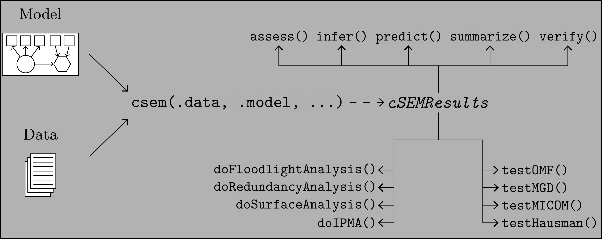

# cSEM: Composite-based SEM 

[](https://cran.r-project.org/package=cSEM)
[](https://github.com/FloSchuberth/cSEM/actions)
[](https://ci.appveyor.com/project/M-E-Rademaker/csem)
[](https://cran.r-project.org/package=cSEM)

## Purpose

Estimate, analyse, test, and study linear, nonlinear, hierarchical and
multi-group structural equation models using composite-based approaches
and procedures, including estimation techniques such as partial least
squares path modeling (PLS-PM) and its derivatives (PLSc, OrdPLSc,
robustPLSc), generalized structured component analysis (GSCA),
generalized structured component analysis with uniqueness terms (GSCAm),
generalized canonical correlation analysis (GCCA), principal component
analysis (PCA), factor score regression (FSR) using sum score,
regression or Bartlett scores (including bias correction using Croon’s
approach), as well as several tests and typical post-estimation
procedures (e.g., verify admissibility of the estimates, assess the
model fit, test the model fit, compute confidence intervals, compare
groups, etc.).

## News (2026-08-24):

- Release of cSEM version 0.7.1.

- Extend calculateHTMT() to allow for asymptotic inference for the HTMT.
  Thanks to Jason Berger for his contribution.

- Fix bug in calculating the moments used to estimate non-linear models.

- Fix bug in testMICOM(). Thanks to manzi0 for this contribution!

- Fix issue with setting a seed in non-interactive session. Thanks to
  Kjell S. Slupphaug and Jason Berger for their contribution.

- Fix bug in PLS-PM estimation of non-linear models involing
  second-order constructs. Thanks Thanks to Kjell S. Slupphaug for this
  contribution.

- Fix smaller issue in the print function for
  [`assess()`](https://floschuberth.github.io/cSEM/reference/assess.md).

- Replace helper function from the matrixcalc package. Thanks to
  Kjell S. Slupphaug for this contribution.

- Replace the polycor package by a more efficient implementation to
  calculate polychoric/polyserial correlations. Thanks to Kjell S.
  Slupphaug who contributed this implementation.

- Adjust p-value calculation in testMGD in case of permutation-based
  tests to prevent that p-values can be exactly 0. Thanks to Michael

- Fix bug in BasicCIResample(). Thanks to Michael Truong.

- Implementation of doModelSearch() to perform AGAS-PLS. Thanks to
  Gloria Pietropolli.

- Release of cSEM version 0.6.1

- Release of cSEM Version 0.6.0

- Implementation of a
  [`plot()`](https://rdrr.io/r/graphics/plot.default.html) function to
  visualize cSEM models. Thanks to Nguyen.

- Enhancement of the
  [`predict()`](https://floschuberth.github.io/cSEM/reference/predict.md)
  function

## Installation

The package is available on [CRAN](https://cran.r-project.org/):

``` r

install.packages("cSEM")
```

To install the development version, which is recommended, use:

``` r

# install.packages("pak")
pak::pak("FloSchuberth/cSEM")
```

## Getting started

The best place to get started is the
[cSEM-website](https://floschuberth.github.io/cSEM/).

## Basic usage

The basic usage is illustrated below.



Usually, using `cSEM` is the same 3 step procedure:

> 1.  Pick a dataset and specify a model using [lavaan
>     syntax](https://lavaan.ugent.be/tutorial/syntax1.html)
> 2.  Use
>     [`csem()`](https://floschuberth.github.io/cSEM/reference/csem.md)
> 3.  Apply one of the post-estimation functions listed below on the
>     resulting object.

## Post-Estimation Functions

There are five major post-estimation verbs, three test family functions
and three do-family of function:

- [`assess()`](https://floschuberth.github.io/cSEM/reference/assess.md)
  : assess the model using common quality criteria
- [`infer()`](https://floschuberth.github.io/cSEM/reference/infer.md) :
  calculate common inferential quantities (e.g., standard errors,
  confidence intervals)
- [`predict()`](https://floschuberth.github.io/cSEM/reference/predict.md)
  : predict endogenous indicator values
- [`plot()`](https://rdrr.io/r/graphics/plot.default.html) : Plot the
  cSEM model
- [`summarize()`](https://floschuberth.github.io/cSEM/reference/summarize.md)
  : summarize the results
- [`verify()`](https://floschuberth.github.io/cSEM/reference/verify.md)
  : verify admissibility of the estimates

Tests are performed by using the test family of functions. Currently,
the following tests are implemented:

- [`testCVPAT()`](https://floschuberth.github.io/cSEM/reference/testCVPAT.md)
  performs a cross-validated predictive ability test
- [`testOMF()`](https://floschuberth.github.io/cSEM/reference/testOMF.md)
  : performs a test for overall model fit
- [`testMICOM()`](https://floschuberth.github.io/cSEM/reference/testMICOM.md)
  : performs a test for composite measurement invariance
- [`testMGD()`](https://floschuberth.github.io/cSEM/reference/testMGD.md)
  : performs several tests to assess multi-group differences
- [`testHausman()`](https://floschuberth.github.io/cSEM/reference/testHausman.md)
  : performs the regression-based Hausman test to test for endogeneity

Other miscellaneous post-estimation functions belong do the do-family of
functions. Currently, three do functions are implemented:

- [`doIPMA()`](https://floschuberth.github.io/cSEM/reference/doIPMA.md):
  performs an importance-performance matrix analysis
- [`doNonlinearEffectsAnalysis()`](https://floschuberth.github.io/cSEM/reference/doNonlinearEffectsAnalysis.md):
  performs a nonlinear effects analysis such as floodlight and surface
  analysis
- [`doRedundancyAnalysis()`](https://floschuberth.github.io/cSEM/reference/doRedundancyAnalysis.md):
  performs a redundancy analysis

All functions require a `cSEMResults` object.

## Example

Models are defined using [lavaan
syntax](https://lavaan.ugent.be/tutorial/syntax1.html) with some slight
modifications (see the [Specifying a
model](https://floschuberth.github.io/cSEM/articles/cSEM.html#using-csem)
section on the [cSEM-website](https://floschuberth.github.io/cSEM/)).
For illustration we use the build-in and well-known `satisfaction`
dataset.

``` r

require(cSEM)
    
## Note: The operator "<~" tells cSEM that the construct to its left is modeled
##       as a composite.
##       The operator "=~" tells cSEM that the construct to its left is modeled
##       as a common factor.
##       The operator "~" tells cSEM which are the dependent (left-hand side) and
##       independent variables (right-hand side).
    
model <- "
# Structural model
EXPE ~ IMAG
QUAL ~ EXPE
VAL  ~ EXPE + QUAL
SAT  ~ IMAG + EXPE + QUAL + VAL 
LOY  ~ IMAG + SAT

# Composite model
IMAG <~ imag1 + imag2 + imag3
EXPE <~ expe1 + expe2 + expe3 
QUAL <~ qual1 + qual2 + qual3 + qual4 + qual5
VAL  <~ val1  + val2  + val3

# Reflective measurement model
SAT  =~ sat1  + sat2  + sat3  + sat4
LOY  =~ loy1  + loy2  + loy3  + loy4
"
```

The estimation is conducted using the
[`csem()`](https://floschuberth.github.io/cSEM/reference/csem.md)
function.

``` r

# Estimate using defaults
res <- csem(.data = satisfaction, .model = model)
res
```

``` R
## ________________________________________________________________________________
## ----------------------------------- Overview -----------------------------------
## 
## Estimation was successful.
## 
## The result is a list of class cSEMResults with list elements:
## 
##  - Estimates
##  - Information
## 
## To get an overview or help type:
## 
##  - ?cSEMResults
##  - str(<object-name>)
##  - listviewer::jsondedit(<object-name>, mode = 'view')
## 
## If you wish to access the list elements directly type e.g. 
## 
##  - <object-name>$Estimates
## 
## Available postestimation commands:
## 
##  - assess(<object-name>)
##  - infer(<object-name)
##  - predict(<object-name>)
##  - summarize(<object-name>)
##  - verify(<object-name>)
## ________________________________________________________________________________
```

This is equal to:

``` r

csem(
   .data                        = satisfaction,
   .model                       = model,
   .approach_cor_robust         = "none",
   .approach_nl                 = "sequential",
   .approach_paths              = "OLS",
   .approach_weights            = "PLS-PM",
   .conv_criterion              = "diff_absolute",
   .disattenuate                = TRUE,
   .dominant_indicators         = NULL,
   .estimate_structural         = TRUE,
   .id                          = NULL,
   .iter_max                    = 100,
   .normality                   = FALSE,
   .PLS_approach_cf             = "dist_squared_euclid",
   .PLS_ignore_structural_model = FALSE,
   .PLS_modes                   = NULL,
   .PLS_weight_scheme_inner     = "path",
   .reliabilities               = NULL,
   .starting_values             = NULL,
   .tolerance                   = 1e-05,
   .resample_method             = "none", 
   .resample_method2            = "none",
   .R                           = 499,
   .R2                          = 199,
   .handle_inadmissibles        = "drop",
   .user_funs                   = NULL,
   .eval_plan                   = "sequential",
   .seed                        = NULL,
   .sign_change_option          = "none"
    )
```

The result is always a named list of class `cSEMResults`.

To access list elements use `$`:

``` r

res$Estimates$Loading_estimates 
res$Information$Model
```

A useful tool to examine a list is the [listviewer
package](https://github.com/timelyportfolio/listviewer/). If you are new
to `cSEM` this might be a good way to familiarize yourself with the
structure of a `cSEMResults` object.

``` r

listviewer::jsonedit(res, mode = "view") # requires the listviewer package.
```

Apply post-estimation functions:

``` r

## Get a summary
summarize(res) 
```

``` R
## ________________________________________________________________________________
## ----------------------------------- Overview -----------------------------------
## 
##  General information:
##  ------------------------
##  Estimation status                  = Ok
##  Number of observations             = 250
##  Weight estimator                   = PLS-PM
##  Inner weighting scheme             = "path"
##  Type of indicator correlation      = Pearson
##  Path model estimator               = OLS
##  Second-order approach              = NA
##  Type of path model                 = Linear
##  Disattenuated                      = Yes (PLSc)
## 
##  Construct details:
##  ------------------
##  Name  Modeled as     Order         Mode      
## 
##  IMAG  Composite      First order   "modeB"   
##  EXPE  Composite      First order   "modeB"   
##  QUAL  Composite      First order   "modeB"   
##  VAL   Composite      First order   "modeB"   
##  SAT   Common factor  First order   "modeA"   
##  LOY   Common factor  First order   "modeA"   
## 
## ----------------------------------- Estimates ----------------------------------
## 
## Estimated path coefficients:
## ============================
##   Path           Estimate  Std. error   t-stat.   p-value
##   EXPE ~ IMAG      0.4714          NA        NA        NA
##   QUAL ~ EXPE      0.8344          NA        NA        NA
##   VAL ~ EXPE       0.0457          NA        NA        NA
##   VAL ~ QUAL       0.7013          NA        NA        NA
##   SAT ~ IMAG       0.2450          NA        NA        NA
##   SAT ~ EXPE      -0.0172          NA        NA        NA
##   SAT ~ QUAL       0.2215          NA        NA        NA
##   SAT ~ VAL        0.5270          NA        NA        NA
##   LOY ~ IMAG       0.1819          NA        NA        NA
##   LOY ~ SAT        0.6283          NA        NA        NA
## 
## Estimated loadings:
## ===================
##   Loading          Estimate  Std. error   t-stat.   p-value
##   IMAG =~ imag1      0.6306          NA        NA        NA
##   IMAG =~ imag2      0.9246          NA        NA        NA
##   IMAG =~ imag3      0.9577          NA        NA        NA
##   EXPE =~ expe1      0.7525          NA        NA        NA
##   EXPE =~ expe2      0.9348          NA        NA        NA
##   EXPE =~ expe3      0.7295          NA        NA        NA
##   QUAL =~ qual1      0.7861          NA        NA        NA
##   QUAL =~ qual2      0.9244          NA        NA        NA
##   QUAL =~ qual3      0.7560          NA        NA        NA
##   QUAL =~ qual4      0.7632          NA        NA        NA
##   QUAL =~ qual5      0.7834          NA        NA        NA
##   VAL =~ val1        0.9518          NA        NA        NA
##   VAL =~ val2        0.8056          NA        NA        NA
##   VAL =~ val3        0.6763          NA        NA        NA
##   SAT =~ sat1        0.9243          NA        NA        NA
##   SAT =~ sat2        0.8813          NA        NA        NA
##   SAT =~ sat3        0.7127          NA        NA        NA
##   SAT =~ sat4        0.7756          NA        NA        NA
##   LOY =~ loy1        0.9097          NA        NA        NA
##   LOY =~ loy2        0.5775          NA        NA        NA
##   LOY =~ loy3        0.9043          NA        NA        NA
##   LOY =~ loy4        0.4917          NA        NA        NA
## 
## Estimated weights:
## ==================
##   Weight           Estimate  Std. error   t-stat.   p-value
##   IMAG <~ imag1      0.0156          NA        NA        NA
##   IMAG <~ imag2      0.4473          NA        NA        NA
##   IMAG <~ imag3      0.6020          NA        NA        NA
##   EXPE <~ expe1      0.2946          NA        NA        NA
##   EXPE <~ expe2      0.6473          NA        NA        NA
##   EXPE <~ expe3      0.2374          NA        NA        NA
##   QUAL <~ qual1      0.2370          NA        NA        NA
##   QUAL <~ qual2      0.4712          NA        NA        NA
##   QUAL <~ qual3      0.1831          NA        NA        NA
##   QUAL <~ qual4      0.1037          NA        NA        NA
##   QUAL <~ qual5      0.2049          NA        NA        NA
##   VAL <~ val1        0.7163          NA        NA        NA
##   VAL <~ val2        0.2202          NA        NA        NA
##   VAL <~ val3        0.2082          NA        NA        NA
##   SAT <~ sat1        0.3209          NA        NA        NA
##   SAT <~ sat2        0.3059          NA        NA        NA
##   SAT <~ sat3        0.2474          NA        NA        NA
##   SAT <~ sat4        0.2692          NA        NA        NA
##   LOY <~ loy1        0.3834          NA        NA        NA
##   LOY <~ loy2        0.2434          NA        NA        NA
##   LOY <~ loy3        0.3812          NA        NA        NA
##   LOY <~ loy4        0.2073          NA        NA        NA
## 
## Estimated indicator correlations:
## =================================
##   Correlation       Estimate  Std. error   t-stat.   p-value
##   imag1 ~~ imag2      0.6437          NA        NA        NA
##   imag1 ~~ imag3      0.5433          NA        NA        NA
##   imag2 ~~ imag3      0.7761          NA        NA        NA
##   expe1 ~~ expe2      0.5353          NA        NA        NA
##   expe1 ~~ expe3      0.4694          NA        NA        NA
##   expe2 ~~ expe3      0.5467          NA        NA        NA
##   qual1 ~~ qual2      0.6053          NA        NA        NA
##   qual1 ~~ qual3      0.5406          NA        NA        NA
##   qual1 ~~ qual4      0.5662          NA        NA        NA
##   qual1 ~~ qual5      0.5180          NA        NA        NA
##   qual2 ~~ qual3      0.6187          NA        NA        NA
##   qual2 ~~ qual4      0.6517          NA        NA        NA
##   qual2 ~~ qual5      0.6291          NA        NA        NA
##   qual3 ~~ qual4      0.4752          NA        NA        NA
##   qual3 ~~ qual5      0.5074          NA        NA        NA
##   qual4 ~~ qual5      0.6402          NA        NA        NA
##   val1 ~~ val2        0.6344          NA        NA        NA
##   val1 ~~ val3        0.4602          NA        NA        NA
##   val2 ~~ val3        0.6288          NA        NA        NA
## 
## ------------------------------------ Effects -----------------------------------
## 
## Estimated total effects:
## ========================
##   Total effect    Estimate  Std. error   t-stat.   p-value
##   EXPE ~ IMAG       0.4714          NA        NA        NA
##   QUAL ~ IMAG       0.3933          NA        NA        NA
##   QUAL ~ EXPE       0.8344          NA        NA        NA
##   VAL ~ IMAG        0.2974          NA        NA        NA
##   VAL ~ EXPE        0.6309          NA        NA        NA
##   VAL ~ QUAL        0.7013          NA        NA        NA
##   SAT ~ IMAG        0.4807          NA        NA        NA
##   SAT ~ EXPE        0.5001          NA        NA        NA
##   SAT ~ QUAL        0.5911          NA        NA        NA
##   SAT ~ VAL         0.5270          NA        NA        NA
##   LOY ~ IMAG        0.4840          NA        NA        NA
##   LOY ~ EXPE        0.3142          NA        NA        NA
##   LOY ~ QUAL        0.3714          NA        NA        NA
##   LOY ~ VAL         0.3311          NA        NA        NA
##   LOY ~ SAT         0.6283          NA        NA        NA
## 
## Estimated indirect effects:
## ===========================
##   Indirect effect    Estimate  Std. error   t-stat.   p-value
##   QUAL ~ IMAG          0.3933          NA        NA        NA
##   VAL ~ IMAG           0.2974          NA        NA        NA
##   VAL ~ EXPE           0.5852          NA        NA        NA
##   SAT ~ IMAG           0.2357          NA        NA        NA
##   SAT ~ EXPE           0.5173          NA        NA        NA
##   SAT ~ QUAL           0.3696          NA        NA        NA
##   LOY ~ IMAG           0.3020          NA        NA        NA
##   LOY ~ EXPE           0.3142          NA        NA        NA
##   LOY ~ QUAL           0.3714          NA        NA        NA
##   LOY ~ VAL            0.3311          NA        NA        NA
## ________________________________________________________________________________
```

``` r

## Verify admissibility of the results
verify(res) 
```

``` R
## ________________________________________________________________________________
## 
## Verify admissibility:
## 
##   admissible
## 
## Details:
## 
##   Code   Status    Description
##   1      ok        Convergence achieved                                   
##   2      ok        All absolute standardized loading estimates <= 1       
##   3      ok        Construct VCV is positive semi-definite                
##   4      ok        All reliability estimates <= 1                         
##   5      ok        Model-implied indicator VCV is positive semi-definite  
## ________________________________________________________________________________
```

``` r

## Test overall model fit
testOMF(res)
```

``` R
## ________________________________________________________________________________
## --------- Test for overall model fit based on Beran & Srivastava (1985) --------
## 
## Null hypothesis:
## 
##        ┌──────────────────────────────────────────────────────────────────┐
##        │                                                                  │
##        │   H0: The model-implied indicator covariance matrix equals the   │
##        │   population indicator covariance matrix.                        │
##        │                                                                  │
##        └──────────────────────────────────────────────────────────────────┘
## 
## Test statistic and critical value: 
## 
##                                      Critical value
##  Distance measure    Test statistic    95%   
##  dG                      0.6493      0.3199  
##  SRMR                    0.0940      0.0532  
##  dL                      2.2340      0.7171  
##  dML                     2.9219      1.6016  
##  
## 
## Decision: 
## 
##                          Significance level
##  Distance measure          95%   
##  dG                      reject  
##  SRMR                    reject  
##  dL                      reject  
##  dML                     reject  
##  
## Additional information:
## 
##  Out of 499 bootstrap replications 476 are admissible.
##  See ?verify() for what constitutes an inadmissible result.
## 
##  The seed used was: -656976817
## ________________________________________________________________________________
```

``` r

## Assess the model
assess(res)
```

``` R
## ________________________________________________________________________________
## 
##  Construct        AVE           R2          R2_adj    
##  SAT            0.6851        0.7624        0.7585    
##  LOY            0.5552        0.5868        0.5834    
##  EXPE             NA          0.2222        0.2190    
##  QUAL             NA          0.6963        0.6951    
##  VAL              NA          0.5474        0.5438    
## 
## -------------- Common (internal consistency) reliability estimates -------------
## 
##  Construct Cronbachs_alpha   Joereskogs_rho   Dijkstra-Henselers_rho_A 
##  SAT        0.8940           0.8960                0.9051          
##  LOY        0.8194           0.8237                0.8761          
## 
## ----------- Alternative (internal consistency) reliability estimates -----------
## 
##  Construct       RhoC         RhoC_mm    RhoC_weighted
##  SAT            0.8960        0.8938        0.9051    
##  LOY            0.8237        0.8011        0.8761    
## 
##  Construct  RhoC_weighted_mm     RhoT      RhoT_weighted
##  SAT            0.9051        0.8940        0.8869    
##  LOY            0.8761        0.8194        0.7850    
## 
## --------------------------- Distance and fit measures --------------------------
## 
##  Geodesic distance             = 0.6493432
##  Squared Euclidean distance    = 2.23402
##  ML distance                   = 2.921932
## 
##  Chi_square       = 727.5611
##  Chi_square_df    = 3.954137
##  CFI              = 0.8598825
##  CN               = 75.14588
##  GFI              = 0.7280612
##  IFI              = 0.8615598
##  NFI              = 0.8229918
##  NNFI             = 0.8240917
##  RMSEA            = 0.108922
##  RMS_theta        = 0.05069299
##  SRMR             = 0.09396871
## 
##  Degrees of freedom       = 184
## 
## --------------------------- Model selection criteria ---------------------------
## 
##  Construct        AIC          AICc          AICu     
##  EXPE          -59.8152      192.2824      -57.8072   
##  QUAL          -294.9343     -42.8367      -292.9263  
##  VAL           -193.2127      58.9506      -190.1945  
##  SAT           -350.2874     -97.9418      -345.2368  
##  LOY           -215.9322      36.2311      -212.9141  
## 
##  Construct        BIC           FPE           GM      
##  EXPE          -52.7723       0.7872       259.8087   
##  QUAL          -287.8914      0.3074       271.8568   
##  VAL           -182.6483      0.4617       312.7010   
##  SAT           -332.6801      0.2463       278.2973   
##  LOY           -205.3678      0.4216       291.0665   
## 
##  Construct        HQ            HQc       Mallows_Cp  
##  EXPE          -56.9806      -56.8695       2.7658    
##  QUAL          -292.0997     -291.9886      14.8139   
##  VAL           -188.9608     -188.7516      52.1366   
##  SAT           -343.2010     -342.7088      10.6900   
##  LOY           -211.6804     -211.4711      30.5022   
## 
## ----------------------- Variance inflation factors (VIFs) ----------------------
## 
##   Dependent construct: 'VAL'
## 
##  Independent construct    VIF value 
##  EXPE                      3.2928   
##  QUAL                      3.2928   
## 
##   Dependent construct: 'SAT'
## 
##  Independent construct    VIF value 
##  EXPE                      3.2985   
##  QUAL                      4.4151   
##  IMAG                      1.7280   
##  VAL                       2.6726   
## 
##   Dependent construct: 'LOY'
## 
##  Independent construct    VIF value 
##  IMAG                      1.9345   
##  SAT                       1.9345   
## 
## -------------- Variance inflation factors (VIFs) for modeB weights -------------
## 
##   Construct: 'IMAG'
## 
##  Weight    VIF value 
##  imag1      1.7215   
##  imag2      3.0515   
##  imag3      2.5356   
## 
##   Construct: 'EXPE'
## 
##  Weight    VIF value 
##  expe1      1.4949   
##  expe2      1.6623   
##  expe3      1.5212   
## 
##   Construct: 'QUAL'
## 
##  Weight    VIF value 
##  qual1      1.8401   
##  qual2      2.5005   
##  qual3      1.7796   
##  qual4      2.1557   
##  qual5      2.0206   
## 
##   Construct: 'VAL'
## 
##  Weight    VIF value 
##  val1       1.6912   
##  val2       2.2049   
##  val3       1.6714   
## 
## -------------------------- Effect sizes (Cohen's f^2) --------------------------
## 
##   Dependent construct: 'EXPE'
## 
##  Independent construct       f^2    
##  IMAG                      0.2856   
## 
##   Dependent construct: 'QUAL'
## 
##  Independent construct       f^2    
##  EXPE                      2.2928   
## 
##   Dependent construct: 'VAL'
## 
##  Independent construct       f^2    
##  EXPE                      0.0014   
##  QUAL                      0.3301   
## 
##   Dependent construct: 'SAT'
## 
##  Independent construct       f^2    
##  IMAG                      0.1462   
##  EXPE                      0.0004   
##  QUAL                      0.0468   
##  VAL                       0.4373   
## 
##   Dependent construct: 'LOY'
## 
##  Independent construct       f^2    
##  IMAG                      0.0414   
##  SAT                       0.4938   
## 
## ----------------------- Discriminant validity assessment -----------------------
## 
##  Heterotrait-monotrait ratio of correlations matrix (HTMT matrix)
##  ----------------------------------------------------------------
## 
##  Values in the lower triangular part are the absolute HTMT values.
## 
##           SAT LOY
## SAT 1.0000000   0
## LOY 0.7432489   1
## 
## 
##  Advanced heterotrait-monotrait ratio of correlations matrix (HTMT2 matrix)
##  --------------------------------------------------------------------------
## 
##  Values in the lower triangular part are the absolute HTMT2 values.
## 
##           SAT LOY
## SAT 1.0000000   0
## LOY 0.7140046   1
## 
## 
##  Fornell-Larcker matrix
##  ----------------------
##           SAT       LOY
## SAT 0.6851491 0.5696460
## LOY 0.5696460 0.5551718
## 
## 
## ------------------------------------ Effects -----------------------------------
## 
## Estimated total effects:
## ========================
##   Total effect    Estimate  Std. error   t-stat.   p-value
##   EXPE ~ IMAG       0.4714          NA        NA        NA
##   QUAL ~ IMAG       0.3933          NA        NA        NA
##   QUAL ~ EXPE       0.8344          NA        NA        NA
##   VAL ~ IMAG        0.2974          NA        NA        NA
##   VAL ~ EXPE        0.6309          NA        NA        NA
##   VAL ~ QUAL        0.7013          NA        NA        NA
##   SAT ~ IMAG        0.4807          NA        NA        NA
##   SAT ~ EXPE        0.5001          NA        NA        NA
##   SAT ~ QUAL        0.5911          NA        NA        NA
##   SAT ~ VAL         0.5270          NA        NA        NA
##   LOY ~ IMAG        0.4840          NA        NA        NA
##   LOY ~ EXPE        0.3142          NA        NA        NA
##   LOY ~ QUAL        0.3714          NA        NA        NA
##   LOY ~ VAL         0.3311          NA        NA        NA
##   LOY ~ SAT         0.6283          NA        NA        NA
## 
## Estimated indirect effects:
## ===========================
##   Indirect effect    Estimate  Std. error   t-stat.   p-value
##   QUAL ~ IMAG          0.3933          NA        NA        NA
##   VAL ~ IMAG           0.2974          NA        NA        NA
##   VAL ~ EXPE           0.5852          NA        NA        NA
##   SAT ~ IMAG           0.2357          NA        NA        NA
##   SAT ~ EXPE           0.5173          NA        NA        NA
##   SAT ~ QUAL           0.3696          NA        NA        NA
##   LOY ~ IMAG           0.3020          NA        NA        NA
##   LOY ~ EXPE           0.3142          NA        NA        NA
##   LOY ~ QUAL           0.3714          NA        NA        NA
##   LOY ~ VAL            0.3311          NA        NA        NA
## 
## Variance accounted for (VAF):
## =============================
##   Effects        Estimate  Std. error   t-stat.   p-value
##   QUAL ~ IMAG      1.0000          NA        NA        NA
##   VAL ~ IMAG       1.0000          NA        NA        NA
##   VAL ~ EXPE       0.9275          NA        NA        NA
##   SAT ~ IMAG       0.4904          NA        NA        NA
##   SAT ~ EXPE       1.0345          NA        NA        NA
##   SAT ~ QUAL       0.6252          NA        NA        NA
##   LOY ~ IMAG       0.6241          NA        NA        NA
##   LOY ~ EXPE       1.0000          NA        NA        NA
##   LOY ~ QUAL       1.0000          NA        NA        NA
##   LOY ~ VAL        1.0000          NA        NA        NA
## ________________________________________________________________________________
```

``` r

## Predict indicator scores of endogenous constructs
predict(res)
```

``` R
## ________________________________________________________________________________
## ----------------------------------- Overview -----------------------------------
## 
##  Number of obs. training            = 225
##  Number of obs. test                = 25
##  Number of cv folds                 = 10
##  Number of repetitions              = 1
##  Handle inadmissibles               = stop
##  Estimator target                   = 'PLS-PM'
##  Estimator benchmark                = 'lm'
##  Disattenuation target              = 'TRUE'
##  Disattenuation benchmark           = 'FALSE'
##  Approach to predict                = 'earliest'
## 
## ------------------------------ Prediction metrics ------------------------------
## 
## 
##   Name      MAE target  MAE benchmark  RMSE target RMSE benchmark   Q2_predict
##   expe1         1.4512         1.5818       1.8967         2.0830       0.0609
##   expe2         1.4044         1.4867       1.9239         2.0229       0.2055
##   expe3         1.6281         1.7387       2.1185         2.2206       0.1259
##   qual1         1.4736         1.5542       1.9220         2.0395       0.1176
##   qual2         1.5784         1.5499       2.0397         2.0738       0.2167
##   qual3         1.7292         1.7359       2.2187         2.2809       0.1197
##   qual4         1.2324         1.1998       1.5956         1.6432       0.2339
##   qual5         1.4980         1.5130       1.9274         1.9590       0.1984
##   val1          1.4447         1.3619       1.8675         1.7672       0.2491
##   val2          1.2345         1.2170       1.6586         1.7091       0.1646
##   val3          1.4827         1.3903       1.9730         1.9299       0.1432
##   sat1          1.2412         1.2260       1.6342         1.6159       0.3454
##   sat2          1.2268         1.2018       1.6310         1.6278       0.3157
##   sat3          1.3422         1.2959       1.6746         1.7286       0.2062
##   sat4          1.3191         1.2633       1.6670         1.6365       0.2767
##   loy1          1.6891         1.6664       2.2355         2.2333       0.2657
##   loy2          1.4881         1.4845       1.9123         1.9761       0.1336
##   loy3          1.6985         1.6670       2.2690         2.2612       0.2765
##   loy4          1.6996         1.6838       2.1897         2.3077       0.0803
## ________________________________________________________________________________
```

#### Resampling and Inference

By default no inferential statistics are calculated since most
composite-based estimators have no closed-form expressions for standard
errors. Resampling is used instead. `cSEM` mostly relies on the
`bootstrap` procedure (although `jackknife` is implemented as well) to
estimate standard errors, test statistics, and critical quantiles.

`cSEM` offers two ways for resampling:

1.  Setting `.resample_method` in
    [`csem()`](https://floschuberth.github.io/cSEM/reference/csem.md) to
    `"jackknife"` or `"bootstrap"` and subsequently using
    post-estimation functions
    [`summarize()`](https://floschuberth.github.io/cSEM/reference/summarize.md)
    or
    [`infer()`](https://floschuberth.github.io/cSEM/reference/infer.md).
2.  The same result is achieved by passing a `cSEMResults` object to
    [`resamplecSEMResults()`](https://floschuberth.github.io/cSEM/reference/resamplecSEMResults.md)
    and subsequently using post-estimation functions
    [`summarize()`](https://floschuberth.github.io/cSEM/reference/summarize.md)
    or
    [`infer()`](https://floschuberth.github.io/cSEM/reference/infer.md).

``` r

# Setting `.resample_method`
b1 <- csem(.data = satisfaction, .model = model, .resample_method = "bootstrap")
# Using resamplecSEMResults()
b2 <- resamplecSEMResults(res)
```

The
[`summarize()`](https://floschuberth.github.io/cSEM/reference/summarize.md)
function reports the inferential statistics:

``` r

summarize(b1)
```

``` R
## ________________________________________________________________________________
## ----------------------------------- Overview -----------------------------------
## 
##  General information:
##  ------------------------
##  Estimation status                  = Ok
##  Number of observations             = 250
##  Weight estimator                   = PLS-PM
##  Inner weighting scheme             = "path"
##  Type of indicator correlation      = Pearson
##  Path model estimator               = OLS
##  Second-order approach              = NA
##  Type of path model                 = Linear
##  Disattenuated                      = Yes (PLSc)
## 
##  Resample information:
##  ---------------------
##  Resample method                    = "bootstrap"
##  Number of resamples                = 499
##  Number of admissible results       = 481
##  Approach to handle inadmissibles   = "drop"
##  Sign change option                 = "none"
##  Random seed                        = -675569979
## 
##  Construct details:
##  ------------------
##  Name  Modeled as     Order         Mode      
## 
##  IMAG  Composite      First order   "modeB"   
##  EXPE  Composite      First order   "modeB"   
##  QUAL  Composite      First order   "modeB"   
##  VAL   Composite      First order   "modeB"   
##  SAT   Common factor  First order   "modeA"   
##  LOY   Common factor  First order   "modeA"   
## 
## ----------------------------------- Estimates ----------------------------------
## 
## Estimated path coefficients:
## ============================
##                                                              CI_percentile   
##   Path           Estimate  Std. error   t-stat.   p-value         95%        
##   EXPE ~ IMAG      0.4714      0.0639    7.3789    0.0000 [ 0.3426; 0.5889 ] 
##   QUAL ~ EXPE      0.8344      0.0234   35.6757    0.0000 [ 0.7877; 0.8766 ] 
##   VAL ~ EXPE       0.0457      0.0795    0.5749    0.5654 [-0.0916; 0.2151 ] 
##   VAL ~ QUAL       0.7013      0.0809    8.6650    0.0000 [ 0.5375; 0.8555 ] 
##   SAT ~ IMAG       0.2450      0.0565    4.3371    0.0000 [ 0.1374; 0.3623 ] 
##   SAT ~ EXPE      -0.0172      0.0740   -0.2327    0.8160 [-0.1670; 0.1380 ] 
##   SAT ~ QUAL       0.2215      0.1071    2.0686    0.0386 [ 0.0250; 0.4421 ] 
##   SAT ~ VAL        0.5270      0.0910    5.7877    0.0000 [ 0.3427; 0.6948 ] 
##   LOY ~ IMAG       0.1819      0.0823    2.2104    0.0271 [ 0.0328; 0.3577 ] 
##   LOY ~ SAT        0.6283      0.0866    7.2544    0.0000 [ 0.4586; 0.7805 ] 
## 
## Estimated loadings:
## ===================
##                                                                CI_percentile   
##   Loading          Estimate  Std. error   t-stat.   p-value         95%        
##   IMAG =~ imag1      0.6306      0.0982    6.4200    0.0000 [ 0.4238; 0.8024 ] 
##   IMAG =~ imag2      0.9246      0.0400   23.1025    0.0000 [ 0.8290; 0.9801 ] 
##   IMAG =~ imag3      0.9577      0.0294   32.5284    0.0000 [ 0.8835; 0.9925 ] 
##   EXPE =~ expe1      0.7525      0.0802    9.3886    0.0000 [ 0.5638; 0.8717 ] 
##   EXPE =~ expe2      0.9348      0.0284   32.9625    0.0000 [ 0.8654; 0.9745 ] 
##   EXPE =~ expe3      0.7295      0.0717   10.1707    0.0000 [ 0.5758; 0.8353 ] 
##   QUAL =~ qual1      0.7861      0.0685   11.4775    0.0000 [ 0.6254; 0.8825 ] 
##   QUAL =~ qual2      0.9244      0.0221   41.8466    0.0000 [ 0.8754; 0.9609 ] 
##   QUAL =~ qual3      0.7560      0.0626   12.0767    0.0000 [ 0.6018; 0.8494 ] 
##   QUAL =~ qual4      0.7632      0.0537   14.2170    0.0000 [ 0.6418; 0.8534 ] 
##   QUAL =~ qual5      0.7834      0.0458   17.0970    0.0000 [ 0.6890; 0.8625 ] 
##   VAL =~ val1        0.9518      0.0237   40.2070    0.0000 [ 0.9002; 0.9839 ] 
##   VAL =~ val2        0.8056      0.0640   12.5887    0.0000 [ 0.6601; 0.9048 ] 
##   VAL =~ val3        0.6763      0.0710    9.5262    0.0000 [ 0.5170; 0.8017 ] 
##   SAT =~ sat1        0.9243      0.0228   40.4635    0.0000 [ 0.8690; 0.9587 ] 
##   SAT =~ sat2        0.8813      0.0288   30.5564    0.0000 [ 0.8204; 0.9297 ] 
##   SAT =~ sat3        0.7127      0.0527   13.5184    0.0000 [ 0.6054; 0.8095 ] 
##   SAT =~ sat4        0.7756      0.0525   14.7817    0.0000 [ 0.6713; 0.8679 ] 
##   LOY =~ loy1        0.9097      0.0511   17.7995    0.0000 [ 0.7846; 0.9818 ] 
##   LOY =~ loy2        0.5775      0.0809    7.1376    0.0000 [ 0.4146; 0.7170 ] 
##   LOY =~ loy3        0.9043      0.0435   20.7800    0.0000 [ 0.8002; 0.9736 ] 
##   LOY =~ loy4        0.4917      0.0971    5.0618    0.0000 [ 0.3205; 0.6817 ] 
## 
## Estimated weights:
## ==================
##                                                                CI_percentile   
##   Weight           Estimate  Std. error   t-stat.   p-value         95%        
##   IMAG <~ imag1      0.0156      0.1137    0.1375    0.8906 [-0.2090; 0.2345 ] 
##   IMAG <~ imag2      0.4473      0.1503    2.9753    0.0029 [ 0.1744; 0.7468 ] 
##   IMAG <~ imag3      0.6020      0.1458    4.1306    0.0000 [ 0.2936; 0.8536 ] 
##   EXPE <~ expe1      0.2946      0.1185    2.4853    0.0129 [ 0.0552; 0.5033 ] 
##   EXPE <~ expe2      0.6473      0.0897    7.2127    0.0000 [ 0.4558; 0.8064 ] 
##   EXPE <~ expe3      0.2374      0.0901    2.6346    0.0084 [ 0.0559; 0.3983 ] 
##   QUAL <~ qual1      0.2370      0.0909    2.6086    0.0091 [ 0.0625; 0.4246 ] 
##   QUAL <~ qual2      0.4712      0.0838    5.6237    0.0000 [ 0.2979; 0.6277 ] 
##   QUAL <~ qual3      0.1831      0.0809    2.2622    0.0237 [ 0.0039; 0.3235 ] 
##   QUAL <~ qual4      0.1037      0.0603    1.7189    0.0856 [-0.0102; 0.2255 ] 
##   QUAL <~ qual5      0.2049      0.0606    3.3809    0.0007 [ 0.0718; 0.3264 ] 
##   VAL <~ val1        0.7163      0.0948    7.5599    0.0000 [ 0.5315; 0.8805 ] 
##   VAL <~ val2        0.2202      0.0928    2.3727    0.0177 [ 0.0519; 0.4021 ] 
##   VAL <~ val3        0.2082      0.0615    3.3852    0.0007 [ 0.0842; 0.3262 ] 
##   SAT <~ sat1        0.3209      0.0159   20.1976    0.0000 [ 0.2941; 0.3539 ] 
##   SAT <~ sat2        0.3059      0.0137   22.2986    0.0000 [ 0.2820; 0.3343 ] 
##   SAT <~ sat3        0.2474      0.0108   22.8044    0.0000 [ 0.2271; 0.2706 ] 
##   SAT <~ sat4        0.2692      0.0125   21.4715    0.0000 [ 0.2462; 0.2948 ] 
##   LOY <~ loy1        0.3834      0.0239   16.0294    0.0000 [ 0.3364; 0.4246 ] 
##   LOY <~ loy2        0.2434      0.0296    8.2221    0.0000 [ 0.1822; 0.2971 ] 
##   LOY <~ loy3        0.3812      0.0283   13.4764    0.0000 [ 0.3219; 0.4343 ] 
##   LOY <~ loy4        0.2073      0.0351    5.9106    0.0000 [ 0.1399; 0.2742 ] 
## 
## Estimated indicator correlations:
## =================================
##                                                                 CI_percentile   
##   Correlation       Estimate  Std. error   t-stat.   p-value         95%        
##   imag1 ~~ imag2      0.6437      0.0631   10.2018    0.0000 [ 0.5117; 0.7446 ] 
##   imag1 ~~ imag3      0.5433      0.0696    7.8102    0.0000 [ 0.4000; 0.6831 ] 
##   imag2 ~~ imag3      0.7761      0.0392   19.8200    0.0000 [ 0.7018; 0.8489 ] 
##   expe1 ~~ expe2      0.5353      0.0597    8.9675    0.0000 [ 0.4149; 0.6440 ] 
##   expe1 ~~ expe3      0.4694      0.0601    7.8136    0.0000 [ 0.3377; 0.5817 ] 
##   expe2 ~~ expe3      0.5467      0.0595    9.1858    0.0000 [ 0.4263; 0.6559 ] 
##   qual1 ~~ qual2      0.6053      0.0576   10.5122    0.0000 [ 0.4742; 0.7099 ] 
##   qual1 ~~ qual3      0.5406      0.0605    8.9362    0.0000 [ 0.4082; 0.6476 ] 
##   qual1 ~~ qual4      0.5662      0.0662    8.5570    0.0000 [ 0.4409; 0.6908 ] 
##   qual1 ~~ qual5      0.5180      0.0703    7.3695    0.0000 [ 0.3686; 0.6505 ] 
##   qual2 ~~ qual3      0.6187      0.0559   11.0583    0.0000 [ 0.4959; 0.7249 ] 
##   qual2 ~~ qual4      0.6517      0.0608   10.7265    0.0000 [ 0.5326; 0.7654 ] 
##   qual2 ~~ qual5      0.6291      0.0549   11.4532    0.0000 [ 0.5210; 0.7363 ] 
##   qual3 ~~ qual4      0.4752      0.0620    7.6662    0.0000 [ 0.3463; 0.5889 ] 
##   qual3 ~~ qual5      0.5074      0.0594    8.5466    0.0000 [ 0.3732; 0.6105 ] 
##   qual4 ~~ qual5      0.6402      0.0567   11.2846    0.0000 [ 0.5136; 0.7329 ] 
##   val1 ~~ val2        0.6344      0.0557   11.3836    0.0000 [ 0.5257; 0.7348 ] 
##   val1 ~~ val3        0.4602      0.0716    6.4297    0.0000 [ 0.3264; 0.5927 ] 
##   val2 ~~ val3        0.6288      0.0610   10.3157    0.0000 [ 0.5162; 0.7492 ] 
## 
## ------------------------------------ Effects -----------------------------------
## 
## Estimated total effects:
## ========================
##                                                               CI_percentile   
##   Total effect    Estimate  Std. error   t-stat.   p-value         95%        
##   EXPE ~ IMAG       0.4714      0.0639    7.3789    0.0000 [ 0.3426; 0.5889 ] 
##   QUAL ~ IMAG       0.3933      0.0593    6.6304    0.0000 [ 0.2745; 0.5118 ] 
##   QUAL ~ EXPE       0.8344      0.0234   35.6757    0.0000 [ 0.7877; 0.8766 ] 
##   VAL ~ IMAG        0.2974      0.0582    5.1086    0.0000 [ 0.1865; 0.4239 ] 
##   VAL ~ EXPE        0.6309      0.0484   13.0475    0.0000 [ 0.5423; 0.7219 ] 
##   VAL ~ QUAL        0.7013      0.0809    8.6650    0.0000 [ 0.5375; 0.8555 ] 
##   SAT ~ IMAG        0.4807      0.0675    7.1260    0.0000 [ 0.3524; 0.6086 ] 
##   SAT ~ EXPE        0.5001      0.0559    8.9437    0.0000 [ 0.3930; 0.6158 ] 
##   SAT ~ QUAL        0.5911      0.0948    6.2340    0.0000 [ 0.3980; 0.7815 ] 
##   SAT ~ VAL         0.5270      0.0910    5.7877    0.0000 [ 0.3427; 0.6948 ] 
##   LOY ~ IMAG        0.4840      0.0683    7.0888    0.0000 [ 0.3554; 0.6307 ] 
##   LOY ~ EXPE        0.3142      0.0550    5.7102    0.0000 [ 0.2165; 0.4357 ] 
##   LOY ~ QUAL        0.3714      0.0845    4.3959    0.0000 [ 0.2133; 0.5668 ] 
##   LOY ~ VAL         0.3311      0.0792    4.1826    0.0000 [ 0.1739; 0.4969 ] 
##   LOY ~ SAT         0.6283      0.0866    7.2544    0.0000 [ 0.4586; 0.7805 ] 
## 
## Estimated indirect effects:
## ===========================
##                                                                  CI_percentile   
##   Indirect effect    Estimate  Std. error   t-stat.   p-value         95%        
##   QUAL ~ IMAG          0.3933      0.0593    6.6304    0.0000 [ 0.2745; 0.5118 ] 
##   VAL ~ IMAG           0.2974      0.0582    5.1086    0.0000 [ 0.1865; 0.4239 ] 
##   VAL ~ EXPE           0.5852      0.0700    8.3586    0.0000 [ 0.4493; 0.7169 ] 
##   SAT ~ IMAG           0.2357      0.0456    5.1677    0.0000 [ 0.1559; 0.3273 ] 
##   SAT ~ EXPE           0.5173      0.0694    7.4517    0.0000 [ 0.3893; 0.6614 ] 
##   SAT ~ QUAL           0.3696      0.0600    6.1590    0.0000 [ 0.2477; 0.4862 ] 
##   LOY ~ IMAG           0.3020      0.0545    5.5419    0.0000 [ 0.2065; 0.4165 ] 
##   LOY ~ EXPE           0.3142      0.0550    5.7102    0.0000 [ 0.2165; 0.4357 ] 
##   LOY ~ QUAL           0.3714      0.0845    4.3959    0.0000 [ 0.2133; 0.5668 ] 
##   LOY ~ VAL            0.3311      0.0792    4.1826    0.0000 [ 0.1739; 0.4969 ] 
## ________________________________________________________________________________
```

Several bootstrap-based confidence intervals are implemented, see
`?infer()`:

``` r

infer(b1, .quantity = c("CI_standard_z", "CI_percentile")) # no print method yet
```

Both bootstrap and jackknife resampling support platform-independent
multiprocessing as well as setting random seeds via the [future
framework](https://github.com/futureverse/future/). For multiprocessing
simply set `.eval_plan = "multisession"` in which case the maximum
number of available cores is used if not on Windows. On Windows as many
separate R instances are opened in the background as there are cores
available instead. Note that this naturally has some overhead so for a
small number of resamples multiprocessing will not always be faster
compared to sequential (single core) processing (the default). Seeds are
set via the `.seed` argument.

``` r

b <- csem(
  .data            = satisfaction,
  .model           = model, 
  .resample_method = "bootstrap",
  .R               = 999,
  .seed            = 98234,
  .eval_plan       = "multisession")
```
